# Hi, I'm João Fernandes 👋

### Maker · Developer · Hardware Enthusiast

I build practical projects where **software meets hardware** — from smart displays and 
IoT devices to FPGA simulations, custom electronics, and automation tools.

---

## 🌱 About me

- 🔧 I enjoy turning ideas into complete, physical products.
- 💡 My interests span embedded systems, IoT, automation, UI design, and digital fabrication.
- 🧩 I like solving the details between disciplines: electronics, enclosures, networking, and software.
- 🚀 I am always learning by building something new.

## ✨ Featured project

<table>
  <tr>
    <td valign="top">
      <h3>🖼️ <a href="https://github.com/MrBroccoliJP/MementoFrame">MementoFrame — Smart Digital Photo Frame</a></h3>
      

        A self-contained <b>Raspberry Pi smart photo frame</b> with a polished kiosk display and a web-based configuration portal. It manages photo slideshows, clocks, weather, Spotify playback, screen schedules, and software updates — with automatic Wi-Fi access-point fallback for easy setup.
      

      

        The project includes the complete software stack, GPIO-controlled display power and brightness, wiring documentation, and custom 3D-printable enclosure parts.
      

      
<b>Tech:</b> Python · Flask · JavaScript · HTML/CSS · Raspberry Pi · GPIO · NetworkManager · Spotify API · WeatherAPI · SSE · systemd · 3D Printing

      <a href="https://github.com/MrBroccoliJP/MementoFrame"><b>Explore the project →</b></a>
    </td>
  </tr>
</table>

## 🚀 More projects

<table>
  <tr>
    <td width="50%" valign="top">
      <h3>🕒 <a href="https://github.com/MrBroccoliJP/MatrixChrono">MatrixChrono</a></h3>
      
A smart IoT matrix-display clock with weather integration and sensor feedback.

      
<b>Tech:</b> C/C++ · Arduino · Wi-Fi · Sensors · LED Displays · PCB Design · 3D Printing

    </td>
    <td width="50%" valign="top">
      <h3>🎞️ <a href="https://github.com/MrBroccoliJP/FilmTagger">FilmTagger</a></h3>
      
A browser-based workflow for tagging film scans, editing image metadata, renaming files, and exporting organized archives.

      
<b>Tech:</b> HTML · CSS · Vanilla JavaScript · EXIF · JSZip

    </td>
  </tr>
  <tr>
    <td width="50%" valign="top">
      <h3>🎛️ <a href="https://github.com/MrBroccoliJP/CtrlDeck">CtrlDeck</a></h3>
      
A custom Arduino-powered media controller with a rotary encoder and eight configurable buttons.

      
<b>Tech:</b> C/C++ · Arduino · Microcontrollers · PCB Design · 3D Printing

    </td>
    <td width="50%" valign="top">
      <h3>🌊 <a href="https://github.com/MrBroccoliJP/UltraWaveMeter">UltraWaveMeter</a></h3>
      
An ultrasonic wave measurement system built with an ESP8266 and HC-SR04 for University of Aveiro research.

      
<b>Tech:</b> C++ · Arduino · ESP8266 · Sensors · Serial Communication · Data Logging

    </td>
  </tr>
  <tr>
    <td width="50%" valign="top">
      <h3>🥤 <a href="https://github.com/MrBroccoliJP/FPGA-Beverage-Dispenser">FPGA Beverage Dispenser</a></h3>
      
An FPGA-powered beverage dispenser simulation with inventory tracking and multiple operating modes.

      
<b>Tech:</b> VHDL · Quartus · FPGA Development · State Machines · Embedded Systems

    </td>
    <td width="50%" valign="top">
      <h3>🛍️ Interactive In-Store Displays FNAC</h3>
      
A responsive kiosk system that presents products, pricing, and videos while adapting automatically to the connected screen.

      
<b>Tech:</b> JavaScript · HTML · CSS · AutoHotkey

    </td>
  </tr>
  <tr>
    <td width="50%" valign="top">
      <h3>🖥️ Store Display Automation FNAC</h3>
      
Software installation and power-management automation for store displays, reducing repetitive setup work.

      
<b>Tech:</b> PowerShell · AutoHotkey · Batch · VBScript · Windows Registry · HTML/CSS

    </td>
  </tr>
</table>

## 🛠️ Toolbox

## 📊 GitHub at a glance

---

### Let's build something interesting.

[GitHub](https://github.com/MrBroccoliJP) · [Email](mailto:joaofernandesjp.dev@gmail.com)

